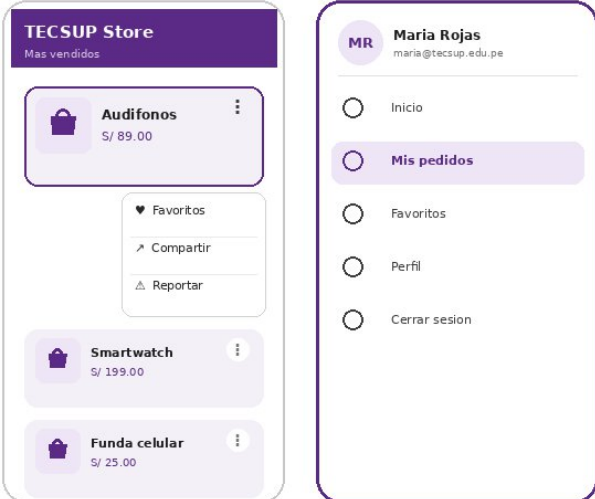

# Prompt 

Actúa como desarrollador Android experto en Kotlin y Jetpack Compose. Trabaja en el proyecto existente TECSUP Store; conserva su package, tema, estructura y configuración. No crees otro proyecto.

Implementa y verifica la mejora de Fase 2: el destino “Favoritos” del Navigation Drawer debe mostrar un badge con el número de productos únicos que el usuario marcó desde el DropdownMenu de cada producto. El contador debe actualizarse inmediatamente al marcar o quitar favoritos. Mantén los datos en memoria; no agregues base de datos, red, ViewModel ni dependencias nuevas.
Imagen referencial del diseño:

